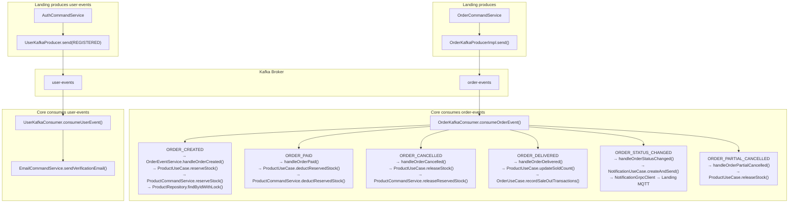
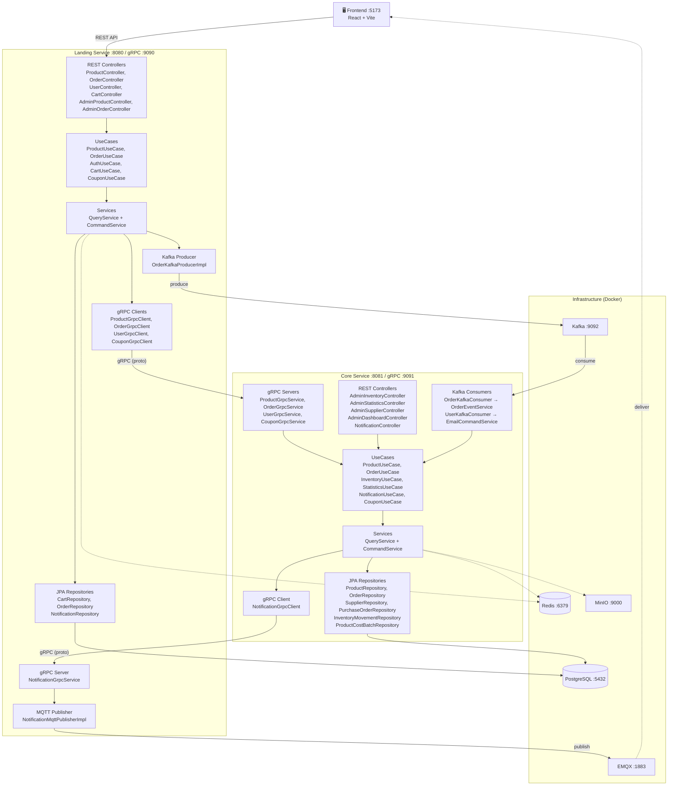
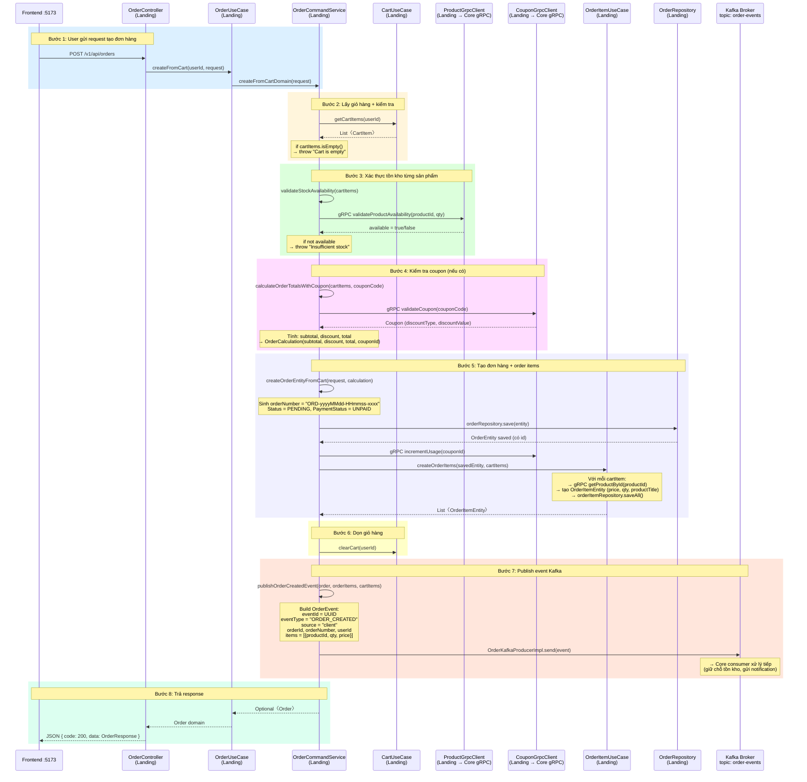
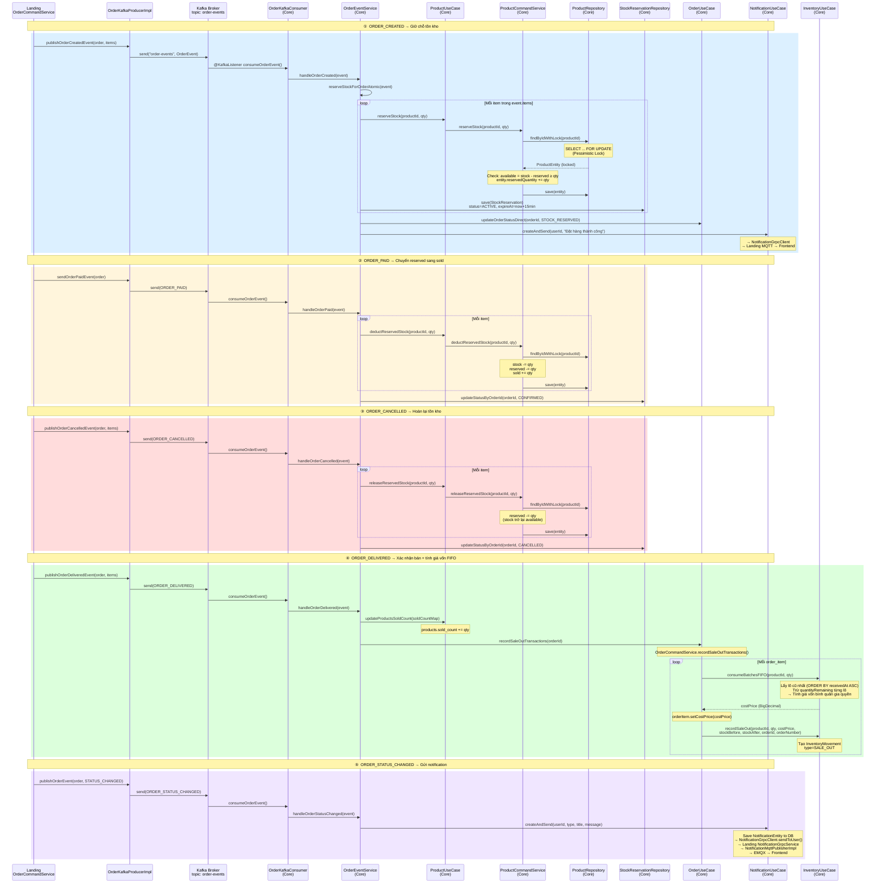

# Kiến trúc Code-Level Flow

## 1. gRPC Flow — Tiêu chuẩn chung (Landing → Core)

```mermaid
flowchart LR
    subgraph Frontend
        FE[User / Browser :5173]
    end

    subgraph "Landing Service :8080 / :9090"
        direction TB
        RC[REST Controller]
        UC_L[UseCase Interface]
        QS_L[QueryService / CommandService]
        GRPC_CLIENT[GrpcClient\n— BlockingStub]
    end

    subgraph "grpc-proto module"
        PROTO[".proto file\n— generated Stub + Message"]
    end

    subgraph "Core Service :8081 / :9091"
        direction TB
        GRPC_SVC[GrpcService\nextends *ImplBase]
        UC_C[UseCase Interface]
        QS_C[QueryService / CommandService]
        REPO[Repository\n— JPA / Database]
    end

    FE -->|"HTTP REST"| RC
    RC --> UC_L --> QS_L --> GRPC_CLIENT
    GRPC_CLIENT -->|"gRPC call\n(protobuf binary)"| PROTO
    PROTO -->|"generated stub"| GRPC_SVC
    GRPC_SVC --> UC_C --> QS_C --> REPO
    REPO -->|"response"| QS_C --> UC_C --> GRPC_SVC
    GRPC_SVC -->|"proto response"| GRPC_CLIENT
    GRPC_CLIENT --> QS_L --> UC_L --> RC
    RC -->|"JSON"| FE
```

---

## 2. Từng gRPC Service — Class cụ thể

```mermaid
flowchart TB
    subgraph "ProductService Flow"
        direction LR
        P1["ProductController\nAdminProductController"]
        P2["ProductUseCase\nAdminProductUseCase"]
        P3["ProductQueryService\nAdminProductQueryService\nAdminProductCommandService"]
        P4["ProductGrpcClient\n→ ProductServiceBlockingStub"]
        P5["ProductGrpcService\nextends ProductServiceImplBase"]
        P6["ProductUseCase\nCategoryUseCase"]
        P7["ProductQueryService\nProductCommandService"]
        P8["ProductRepository"]
    end
    P1 --> P2 --> P3 --> P4 -->|"gRPC"| P5 --> P6 --> P7 --> P8

    subgraph "OrderService Flow"
        direction LR
        O1["OrderController\nAdminOrderController"]
        O2["OrderUseCase"]
        O3["OrderQueryService\nOrderCommandService"]
        O4["OrderGrpcClient\n→ OrderServiceBlockingStub"]
        O5["OrderGrpcService\nextends OrderServiceImplBase"]
        O6["OrderUseCase"]
        O7["OrderQueryService\nOrderCommandService"]
        O8["OrderRepository"]
    end
    O1 --> O2 --> O3 --> O4 -->|"gRPC"| O5 --> O6 --> O7 --> O8

    subgraph "UserService Flow"
        direction LR
        U1["UserController\nAuthController"]
        U2["UserUseCase\nAuthUseCase"]
        U3["UserQueryService\nAuthCommandService"]
        U4["UserGrpcClient\n→ UserServiceBlockingStub"]
        U5["UserGrpcService\nextends UserServiceImplBase"]
        U6["UserUseCase"]
        U7["UserQueryService\nUserCommandService"]
        U8["UserRepository"]
    end
    U1 --> U2 --> U3 --> U4 -->|"gRPC"| U5 --> U6 --> U7 --> U8

    subgraph "CouponService Flow"
        direction LR
        C1["CouponController"]
        C2["CouponUseCase"]
        C3["CouponQueryService"]
        C4["CouponGrpcClient\n→ CouponServiceBlockingStub"]
        C5["CouponGrpcService\nextends CouponServiceImplBase"]
        C6["CouponUseCase"]
        C7["CouponQueryService\nCouponCommandService"]
        C8["CouponRepository"]
    end
    C1 --> C2 --> C3 --> C4 -->|"gRPC"| C5 --> C6 --> C7 --> C8
```

---

## 3. gRPC ngược — NotificationService (Core → Landing)

```mermaid
flowchart LR
    subgraph "Core Service"
        direction TB
        SVC["OrderEventService\n/ NotificationCommandService"]
        NUC["NotificationUseCase"]
        NGC["NotificationGrpcClient\n→ NotificationServiceBlockingStub"]
    end

    subgraph "grpc-proto"
        PROTO["notification_service.proto"]
    end

    subgraph "Landing Service"
        direction TB
        NGS["NotificationGrpcService\nextends NotificationServiceImplBase"]
        NUC_L["NotificationUseCase"]
        NCS_L["NotificationCommandService"]
        MQTT["NotificationMqttPublisherImpl\n→ MqttPahoMessageHandler"]
    end

    subgraph "EMQX :1883"
        BROKER["EMQX Broker"]
    end

    subgraph "Frontend"
        FE["Browser MQTT Client\nsubscribe notifications/#"]
    end

    SVC --> NUC --> NGC -->|"gRPC call"| PROTO --> NGS
    NGS --> NUC_L --> NCS_L --> MQTT
    MQTT -->|"MQTT publish\nnotifications/{userId}/{type}"| BROKER
    BROKER -->|"MQTT deliver"| FE
```

---

## 4. Kafka Flow — Tiêu chuẩn chung

```mermaid
flowchart LR
    subgraph "Landing Service (Producer)"
        direction TB
        OCS["OrderCommandService"]
        KP["OrderKafkaProducerImpl\nimplements OrderKafkaProducer"]
        KT["KafkaTemplate.send()"]
    end

    subgraph "Kafka :9092"
        TOPIC["Topic: order-events"]
    end

    subgraph "Core Service (Consumer)"
        direction TB
        KC["OrderKafkaConsumer\n@KafkaListener"]
        OES["OrderEventService"]
        PUC["ProductUseCase"]
        PCS["ProductCommandService"]
        PR["ProductRepository\nfindByIdWithLock()"]
    end

    OCS -->|"build OrderEvent"| KP --> KT -->|"produce"| TOPIC
    TOPIC -->|"consume"| KC -->|"switch eventType"| OES
    OES --> PUC --> PCS --> PR
```

---

## 5. Kafka — Từng Event Type cụ thể

---

## 6. MQTT Flow — Code-Level

```mermaid
flowchart LR
    subgraph "Core Service"
        C_SVC["OrderEventService\nhoặc NotificationCommandService"]
        C_NUC["NotificationUseCase.createAndSend()"]
        C_DB["NotificationRepository.save()"]
        C_GRPC["NotificationGrpcClient\n.sendToUser() / .broadcast()"]
    end

    subgraph "grpc-proto"
        PROTO["NotificationServiceBlockingStub"]
    end

    subgraph "Landing Service"
        L_GRPC["NotificationGrpcService\n.sendNotification()\n.broadcastNotification()"]
        L_NUC["NotificationUseCase\n.sendToUser() / .broadcast()"]
        L_MQTT["NotificationMqttPublisherImpl\n.publishToUser() / .broadcast()"]
        L_HANDLER["MqttPahoMessageHandler\n.handleMessage()"]
    end

    subgraph "EMQX Broker :1883"
        T_USER["notifications/{userId}/{type}"]
        T_BROADCAST["notifications/broadcast/{type}"]
    end

    subgraph "Frontend :5173"
        FE_SUB["MQTT Client\nsubscribe:\n• notifications/{myId}/#\n• notifications/broadcast/#"]
    end

    C_SVC --> C_NUC --> C_DB
    C_NUC --> C_GRPC -->|"gRPC"| PROTO --> L_GRPC
    L_GRPC --> L_NUC --> L_MQTT --> L_HANDLER
    L_HANDLER -->|"QoS=1"| T_USER
    L_HANDLER -->|"QoS=1"| T_BROADCAST
    T_USER -->|"deliver"| FE_SUB
    T_BROADCAST -->|"deliver"| FE_SUB
```

---

## 7. Tổng quan — 1 hình duy nhất

---

## 8. Luồng thêm vào giỏ hàng và tạo đơn hàng (Code-Level)

---

## 9. Luồng đồng bộ kho qua Kafka — Vòng đời đơn hàng (Code-Level)

---

## Tóm tắt tiêu chuẩn chung

| Hướng | Chuỗi class |
|-------|-------------|
| **FE → Landing → Core (gRPC)** | `Controller` → `UseCase` → `QueryService/CommandService` → `GrpcClient (BlockingStub)` → **proto** → `GrpcService (ImplBase)` → `UseCase` → `QueryService/CommandService` → `Repository` |
| **Landing → Core (Kafka)** | `CommandService` → `KafkaProducerImpl.send()` → **Kafka Broker** → `KafkaConsumer.consume()` → `EventService.handle()` → `UseCase` → `CommandService` → `Repository` |
| **Core → Landing → FE (Notification)** | `EventService/CommandService` → `NotificationUseCase` → `NotificationGrpcClient (BlockingStub)` → **proto** → `NotificationGrpcService (ImplBase)` → `NotificationUseCase` → `MqttPublisherImpl` → **EMQX** → `Frontend MQTT Client` |
| **Admin trực tiếp Core** | `AdminController` → `UseCase` → `QueryService/CommandService` → `Repository` |
