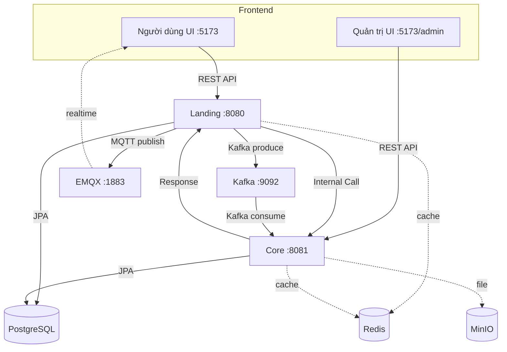
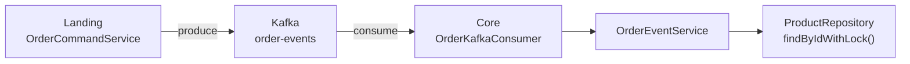
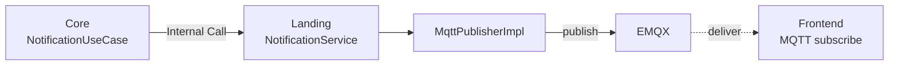
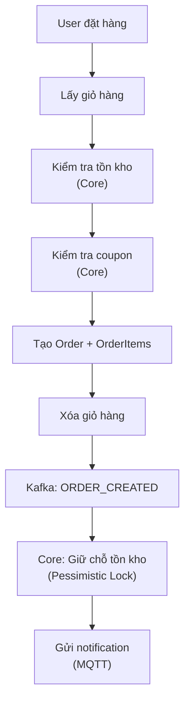
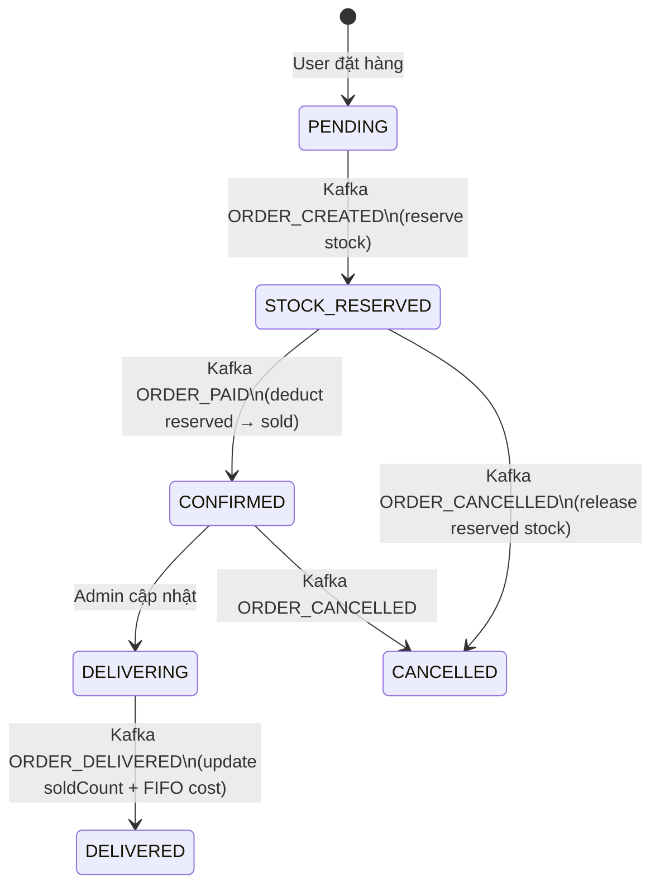

# Kiến trúc hệ thống — Sơ đồ đơn giản

## 1. Tổng quan kiến trúc

**Landing (HTTP 8080):**
Service cung cấp API cho **user/client**. Bao gồm:
- Giỏ hàng (cart), đơn hàng (order)
- Sản phẩm công khai (product public), đánh giá (review)
- Thông tin người dùng (user profile), thanh toán (payment)
- Xác thực: đăng ký, đăng nhập, refresh token

**Core (HTTP 8081):**
Service cung cấp API cho **admin** và xử lý các nghiệp vụ chính:
- Quản lý sản phẩm, đơn hàng, thống kê, kho hàng, nhà cung cấp
- Xử lý nghiệp vụ: quản lý tồn kho, xử lý đơn hàng, định giá
- Xử lý sự kiện Kafka cho quy trình đơn hàng
- Xác thực: đăng nhập, refresh token

## 2. Phân công nghiệp vụ

| Service | Vai trò |
|---------|---------|
| Landing | Cung cấp API cho user/client |
| Core | Cung cấp API cho admin và xử lý nghiệp vụ |

**Khi Landing cần xử lý nghiệp vụ:** Gọi sang Core (Product, Order, User, Coupon)
**Khi Core cần gửi thông báo:** Gọi sang Landing để gửi MQTT realtime

## 3. Kafka: Xử lý đơn hàng bất đồng bộ

| Event | Xử lý |
|-------|-------|
| ORDER_CREATED | Giữ chỗ tồn kho (reserve) |
| ORDER_PAID | Trừ kho (reserved → sold) |
| ORDER_CANCELLED | Hoàn kho (release reserved) |
| ORDER_DELIVERED | Cập nhật sold + tính giá vốn FIFO |
| STATUS_CHANGED | Gửi notification |

## 4. MQTT: Thông báo realtime

**Topic cá nhân:** `notifications/{userId}/{type}`
**Topic broadcast:** `notifications/broadcast/{type}`

## 5. Luồng tạo đơn hàng

## 6. Vòng đời đơn hàng (Stock)

